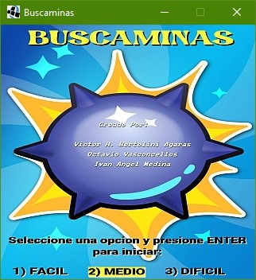
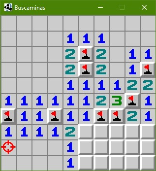
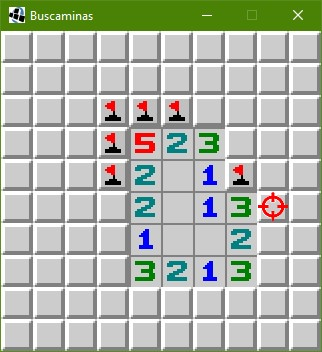

# Buscaminas

## Equipo de desarrollo

- Victor H. Bertolini Agaras
- Octavio Vasconcellos
- Ivan Angel Medina

## Capturas

## Reglas de Juego / Instrucciones

El Buscaminas es un juego de puzzle popular en el que el jugador debe despejar un campo de minas evitando revelar las casillas que contienen minas ocultas. El juego se basa en una cuadrícula rectangular compuesta por casillas que pueden contener minas o números que indican la cantidad de minas adyacentes

Reglas del juego: 
El juego Buscaminas se juega en un tablero cuadrado, donde el objetivo es despejar todas las casillas sin explotar mientras se evitan las minas ocultas. El tablero se compone de casillas que pueden estar vacías o contener minas.
•	Al revelar una casilla vacía, se revela el número de minas adyacentes a esa casilla.
•	Si se revela una casilla que contiene una mina, pierdes el juego.
•	Si se revela una casilla vacía y no hay minas adyacentes, se revelan automáticamente las casillas adyacentes hasta que se alcancen las casillas con minas cercanas.
•	El juego se gana cuando todas las casillas vacías se revelan sin revelar ninguna mina o bien marcar las celdas en donde el jugador piensan que se encuentran las minas.

## Controles

•	*Teclas direccionales*: mueve el cursor.
•	*Espacio*: revela la celda donde se encuentra el cursor.
•	*Tecla m*: marca una celda con una bandera, a su vez desmarca la misma si la celda se encuentra marcada.

## Otros

- Objetos 1, Universidad Nacional de Quilmes
- Versión de Wollok: 3.0.0
- Una vez terminado, no tenemos problemas en que el repositorio sea público
